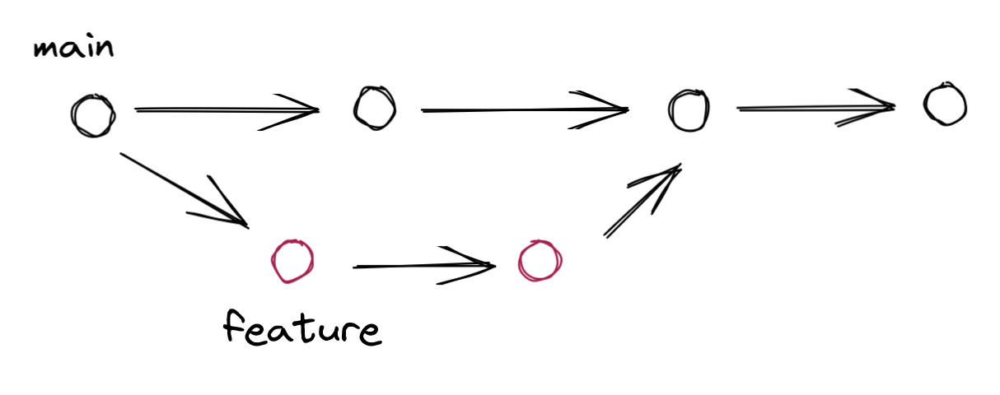
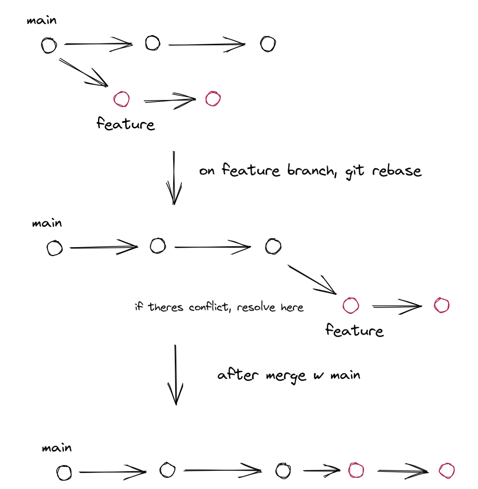

This will be a safe space for whenever I git into problems 

##1st Problem

###Git Rebase (gitflow style)

git rebase -i and the issue of remote and local 

problem came about when there was a merge conflict on remote after i pushed from local. I then resolved the conflict on github... I did not run rebase on my feature branch after merging on remote(why..) 

###Solution
Just follow what my extremely helpful godsent senior colleague taught

#####On main branch:

- git fetch --all (get latest updates from remote)
- git pull --rebase (update main branch)

#####Next, checkout to feature branch

- git checkout feature-branch
- if theres any changes
    - git add filenames (or just . for all)
    - git commit —amend (this wont create a new commit message and instead use the prev one, useful for gitflow style and squashed commits)
- git rebase main  (solve merge conflict if it happens)
    - if you need to squash commits, usually
        - check git log to see the prev commits on local
        - then depending on the commits you want to squash,
        - run git rebase -i HEAD~no.of commits you wanna  squash
- git push -f (when you run rebase on local, the new commit you rebased on main is only on local and not on remote (origin), as such you cant really push it normally(fast-forward))

###What is git rebase?

#####For normal git merge, it looks something like this. 

#####For git rebase

Instead of having a separate branch line, when you run git rebase, it will literally create a new base off on the last commit on the main branch

rebase results in a singular line of commits, making it look cleaner? and less convoluted than with normal merges without rebase.

This can be preferred if the team wants to review the history of commits in a singular timeline instead of one with feature branch multiverses

#####DISCLAIMER If there are any mistakes or gaps in logic or if this is just plain wrong then pray that I achieve englightenment and update this post