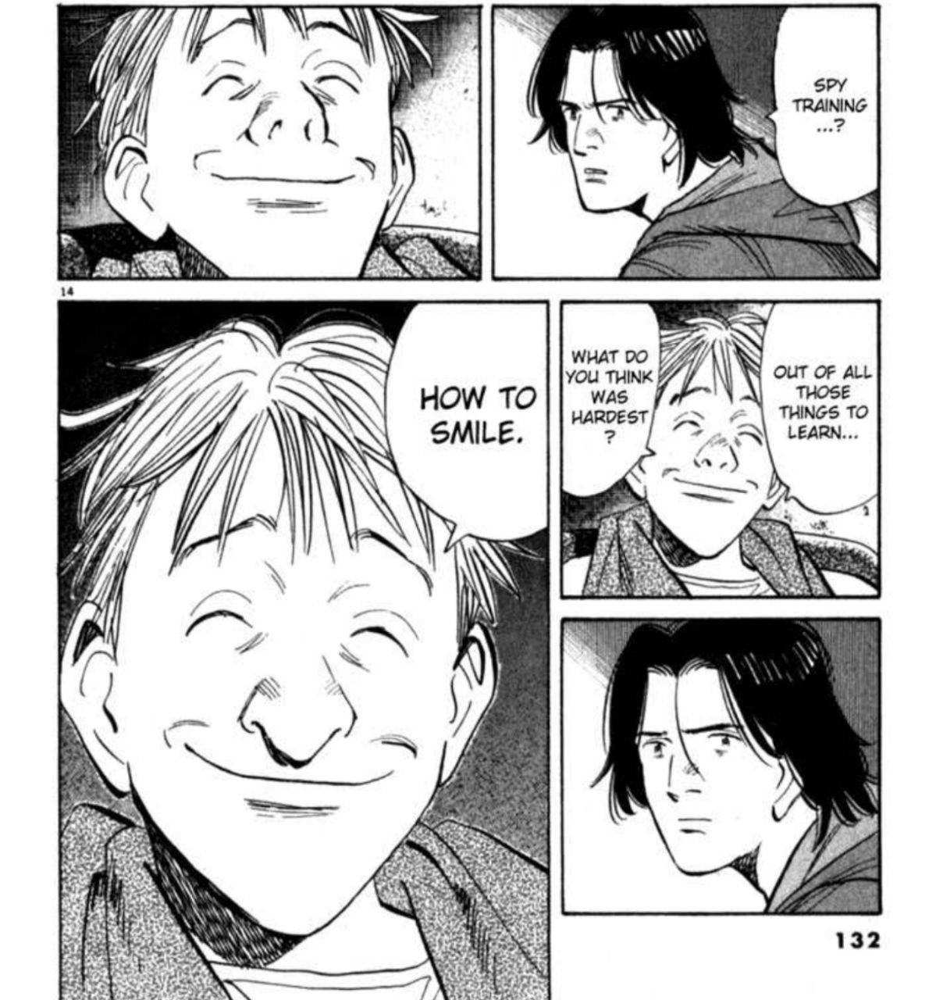
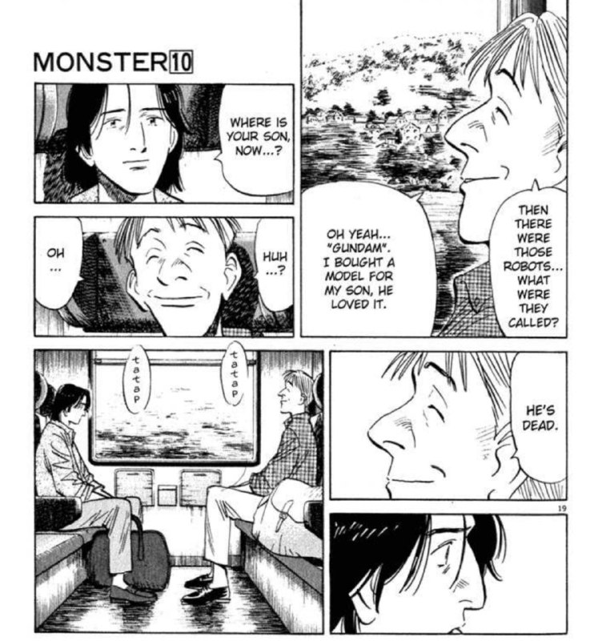

 

# Summary  

Kenzou Tenma, a renowned Japanese neurosurgeon working in post-war Germany, faces a difficult choice: to operate on Johan Liebert, an orphan boy on the verge of death, or on the mayor of Düsseldorf. In the end, Tenma decides to gamble his reputation by saving Johan, effectively leaving the mayor for dead.

As a consequence of his actions, hospital director Heinemann strips Tenma of his position, and Heinemann's daughter Eva breaks off their engagement. Disgraced and shunned by his colleagues, Tenma loses all hope of a successful career—that is, until the mysterious killing of Heinemann gives him another chance.

Nine years later, Tenma is the head of the surgical department and close to becoming the director himself. Although all seems well for him at first, he soon becomes entangled in a chain of gruesome murders that have taken place throughout Germany. The culprit is a monster—the same one that Tenma saved on that fateful day nine years ago.

# Review 

## Character based reviews 

### Tenma and Johan, Good and Evil

 

Age old concept of good vs evil, Tenma embodying pure good, saving everyone he meets as some God tier doctor, always emphasizing on the importance of how every life is equal.

Johan on the other hand, has this callous attitude to human lives, and towards the end saying how humans are only equal in death. (kinda cool sounding quote)

Both share a similar aspect in how they are alone and unwanted (Tenma's family practically does not give a fuck about him somehow in this story) in this world, which I believe contributes to why Johan is enamoured with Tenma and purposely chooses not to kill him throughout the show. 

This sort of yin and yang duality between the two characters was fun to read. Johan's various messages to Tenma, begging Tenma to kill him was engaging throughout.

### Wolfgang Grimmer (The Magnificent Steiner)

My favourite character; partly the reason why I finally finished reading it. Grimmer is a past survivor at the orphanage Kinderheim 511.

He goes around trying to uncover the secrets behind the orphanage, as he had his prior memories stripped away along with his emotions. Going around and expressing kindness to strangers, every scene he was in was poignant as it always hinted how he was acting this way to counteract the horrors he has faced at the orphanage.

### Heinrich Lunge

Goddamn this guy was so annoying at the start. Feels like one of those redditors who are adamant on their opinion and not hearing what others have to say and being extremely dismissive. 

Redeemed himself at the end though, partly from his interaction with Grimmer

### Nina Fortner

Johan's twin and what I presume to be the trigger in Johan's descent into becoming the Monster. Her memories becoming repressed might be why she turned out different from Johan who developed into something far more sinister.

### Other chars not mentioned 

Martin was a good egg, one of the other side characters that I remembered. And of course Mauler (detective killed with the Fortners)

### Verdict

Good manga to binge read, the atmosphere and tension is top notch and makes you want to keep reading it to find out what happens in the end. Some scenes felt super cinematic and would love to see a modern anime remake of this show for sure

